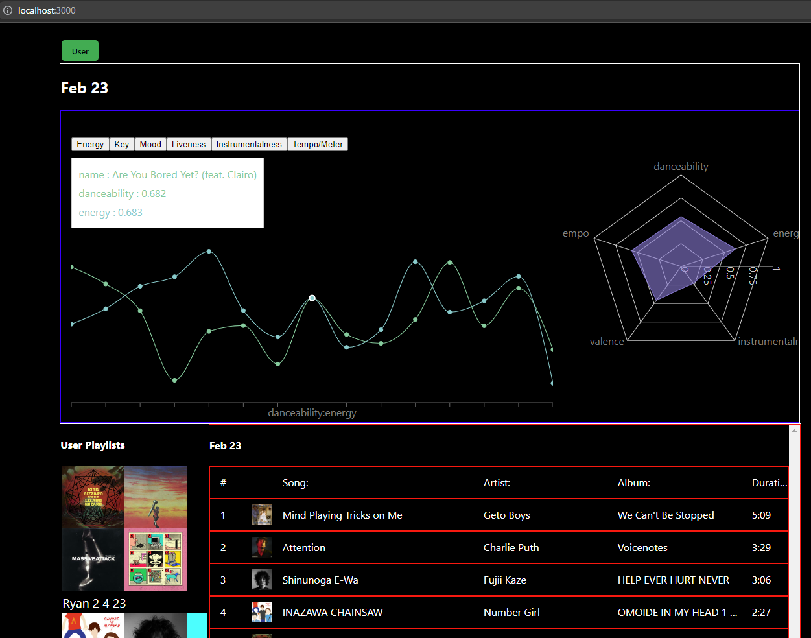

# spotify
As of 2/4/23 this app is function but very ugly/unfinished. Retrieves an individuals spotify playlists using the spotify api and produces analytics across the playlist/song(currently) and the user( in the future). Big TODO is hosting the app.

Frameworks: react, axios, express, rechart, spotify-web-wrapper, spotifyapi

